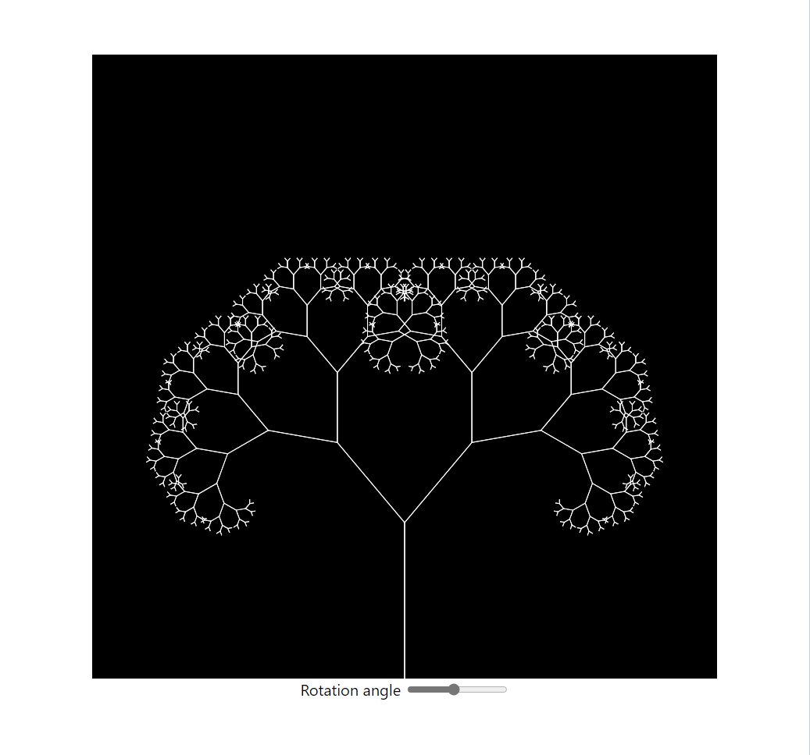

# p5.js clone

A toy project that implements some of the features of p5.js



```javascript
const angle = 45
const startingHeight = 200

function tree(height) {
  if (Math.abs(height) <= 4) {
    return
  }

  push()

  line(0, 0, 0, height)
  translate(0, height)

  for (let multiplier of [-1, 1]) {
    push()
    rotate(angle * multiplier)
    tree(height * 0.67)
    pop()
  }

  pop()
}

function init() {
  size(800, 800)
}

function draw() {
  clear()

  background("black")
  strokeColor("white")

  push()
  translate(400, 800)
  tree(-startingHeight)
  pop()
}

app(document.querySelector("#canvas"), init, draw)
```

## Development Setup

1. Clone the repo

```bash
git clone https://github.com/ivteplo/p5.js-clone
```

2. Navigate to the project root folder

```bash
cd p5.js-clone
```

3. Install dependencies

```bash
npm install
# or, if you prefer yarn:
yarn install
```

4. Start the bundler

```bash
npm run watch
```

5. Run server for the example app (in parallel or after building the library)

```bash
npm run example
```

6. Build for production

```bash
npm run build
```
